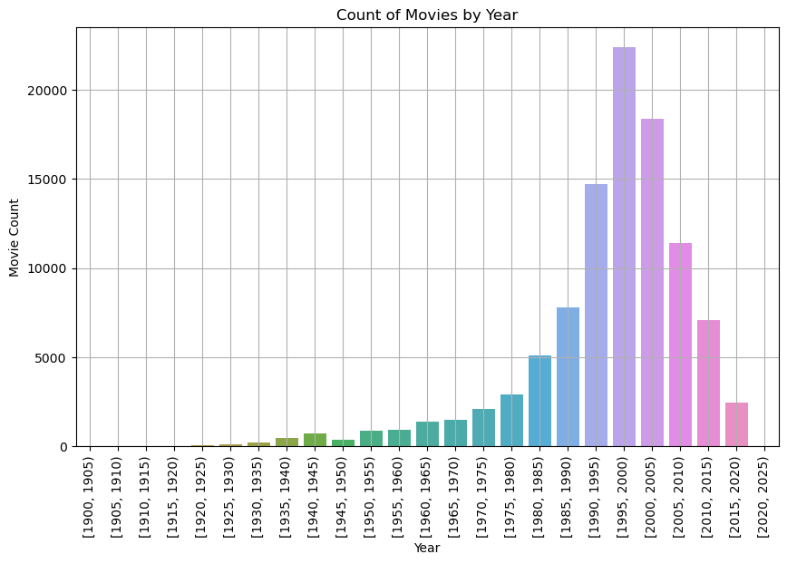
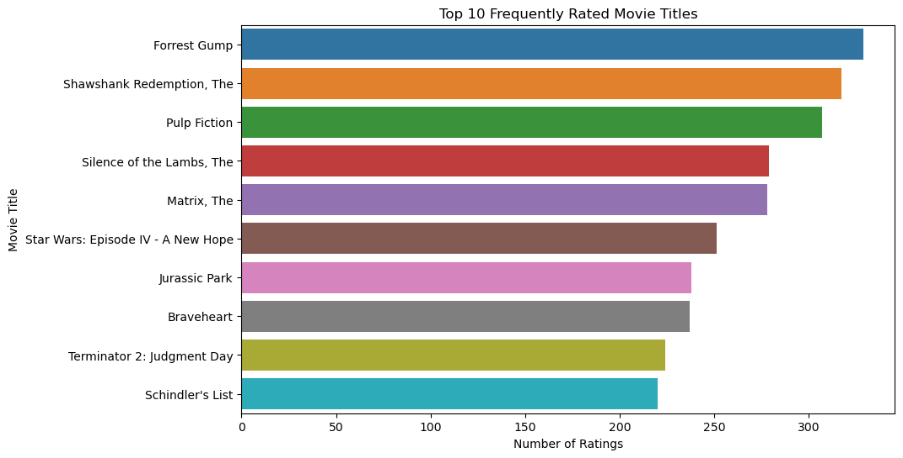
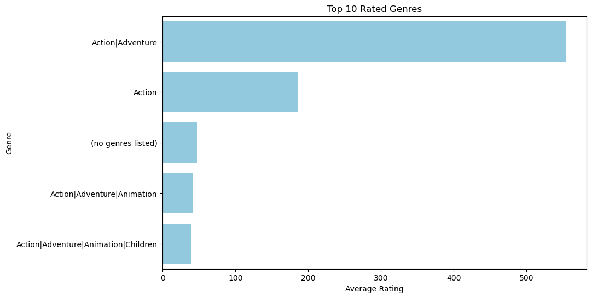

# MOVIELENS RECOMMENDATION SYSTEM

Overview of the project:
- INTRODUCTION
- BUSINESS UNDERSTANDING
- PROBLEM STATEMENT
- DATA UNDERSTANDING
- DATA PREPARATION
- EXPLORATORY DATA ANALYSIS
- MODELLING
- CONCLUSION
- RECOMMENDATIONS
## Introduction
In today's world of countless movie options, it can be challenging for users to find movies that match their preferences.Streaming platforms like Netflix have provided a way of people to consume entertainment.However, with the extensive library of content, users have a difficult time finding shows that align with their preference. Recommendation systems come to the rescue by offering personalized movie recommendations based on user ratings.In this task, I aim to build a recommendation system using the MovieLens dataset to provide users with their top 5 movie recommendations.

## Business Understanding
The objective is to build a recommendation system for Netflix to deliver seemless and personalized user experience by offering accurate movie and TV recommendations. As the Data Scientist involved my goal of this recommendation system is to enhance the movie-watching experience for users by suggesting movies that they are likely to enjoy based on their ratings of other movies. By offering personalized recommendations, one can increase user engagement, satisfaction, and ultimately drive user retention on the platform.
The Stakeholders are:
- Netflix Users - The primary stakeholders, since they rely on the recommendation system to enjoy relevant movies based on their preferences.
- Netflix Management and Executives - They are interested in improving the user satisfaction, increase viewership and maximize revenue.

## Problem Statement
The problem is to build a recommendation system that can accurately predict and recommend the top 5 movies for a user based on their ratings of other movies and genres. The system should leverage collaborative filtering techniques and content based filtering techniques to analyze user preferences and generate accurate recommendations.

## Metric of success
Root Mean Squared Error (RMSE): RMSE is a commonly used evaluation metric for recommendation systems that deal with explicit ratings. It measures the average magnitude of the differences between the predicted ratings and the actual ratings given by users. A lower RMSE indicates better accuracy and performance of the recommendation system.

Mean Absolute Error (MAE): MAE is another widely used metric for recommendation systems. It calculates the average absolute difference between the predicted ratings and the actual ratings. MAE provides a measure of how well the recommendation system can estimate user preferences without considering the direction of the errors. Like RMSE, a lower MAE indicates better accuracy and performance of the recommendation system.

### Data Understanding
The Data sourced for this project was the "movielens Dataset" which was sourced from grouplens.org/datasets/movielens.
The dataset includes:

`ratings.csv`: This file contains user ratings for movies. It includes the following columns:
- **userId**: The ID of the user who provided the rating.
- **movieId**: The ID of the movie being rated.
- **rating**: The rating given by the user to the movie (on a scale of 0.5 to 5 in increments of 0.5).
- **timestamp**: The timestamp when the rating was recorded.

`movies.csv`: This file contains information about movies. It includes the following columns:
- **movieId**: The ID of the movie.
- **title**: The title of the movie along with the release year.
- **genres**: The genre(s) of the movie, separated by "|" if multiple genres apply.

`tags.csv`:This file contains user-generated tags for movies.
Each row represents a specific tag assigned by a user to a movie.

`links.csv`:This file contains links to external movie databases (IMDb and TMDB).

## EDA
Count of Movie Title by Year

Highest Rated Title

Highest rated genre

## Modelling

Performed Content based filtering based on attributes like genres and ratings to provide recommendations.

Performed collaborative filtering techniques like:
- Matrix factorization methods such as SVD and NMF to learn factors that represent user preferences and item characteristics. 
SVD performed best with the lowest RMSE(0.86) and MAE(0.6) when hyperparameter tuning was done.
NMF, RMSE(0.92) and MAE(0.70) which has higher values compared to SVD.
- KNNBasic - Basic KNN algorithmn, relies on finding nearest neighbors based on user-item interactions. RMSE(0.96) and MAE(0.74)
- KNNBaseline - establishes a baseline performance for collaborative filtering-based recommender systems.RMSE(0.87) and MAE(0.67)
- MLP(Multi-Layer Perceptron) - Is a type of articificial neural network consisting of multiple layers of interconnected nodes. RMSE(1.04) and MAE(0.83)

## Conclusion

**EDA:**

Action|Adventure is the highest rated genre.

Content based filtering - Addressed the cold start problem where there is linited or no user data available for new users. Thus by analyzing content by genre and the ratings provided i managed to create a recommendation system based on similarities to the items.

**Modelling:**

Matrix factorization(SVD baseline model and NMF) the SVD perfromed much better as compared to the other models (RMSE 0.85, MAE 0.66), the lower values indicate better accuracy and perfromance.

## RECOMMENDATIONS

Further analysis should be done by feature selection and engineering and also perfrom some ensemble methods to improve on the metrics of success of the models.

Getting more data on user feedback and user satisfaction also will aid in the improvement of the recommendation system.

